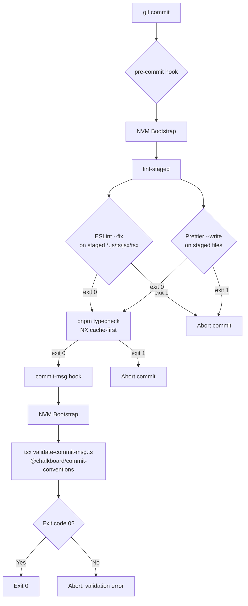

# Design Document: Commit Conventions

## Overview

This design migrates the repository's git hook enforcement from ad-hoc shell scripts to a
managed, version-controlled setup using **husky** (hook manager) and **lint-staged** (staged-file
runner). The migration is a drop-in replacement: all existing branch naming and commit message
validation logic is preserved exactly; only the delivery mechanism changes.

The two hooks produced are:

| Hook         | Responsibility                                                                     |
| ------------ | ---------------------------------------------------------------------------------- |
| `pre-commit` | NVM bootstrap → lint-staged (ESLint + Prettier on staged files) → `pnpm typecheck` |
| `commit-msg` | NVM bootstrap → delegates to `@chalkboard/commit-conventions` via `tsx`            |

Both hooks are stored under `.husky/` at the repository root and are committed to version
control, so every developer receives them automatically after `pnpm install`.

---

## Architecture



### Key design decisions

**husky over alternatives (lefthook, simple-git-hooks):** husky is the de-facto standard in the
Node.js ecosystem, has first-class pnpm support, and the `HUSKY=0` bypass is well-known to CI
operators. The `prepare` lifecycle hook means zero extra setup steps for new developers.

**lint-staged over running linters on the whole repo:** Running ESLint and Prettier on every file
on every commit is prohibitively slow in a monorepo. lint-staged scopes work to only the files
that are actually staged, keeping the pre-commit hook fast.

**NX cache for typecheck:** The typecheck step runs `pnpm typecheck` (which maps to
`nx run-many -t typecheck`). NX's computation cache means that if no TypeScript source files have
changed since the last successful typecheck, the result is replayed instantly. The hook must
never pass `--skip-nx-cache` so this optimisation is always active.

**tsx for commit-msg validation:** The commit-msg hook delegates all validation logic to the
`@chalkboard/commit-conventions` TypeScript package via `tsx`. This eliminates the duplication
between shell regex logic and the TypeScript validation module — the TypeScript code is the
single source of truth for branch naming and commit message format rules. `tsx` is a fast
TypeScript executor that requires no compilation step, making it suitable for git hook use.

**NVM bootstrap pattern:** GUI editors (VS Code, Cursor, etc.) launch git hooks in a restricted
shell that does not source `~/.zshrc` or `~/.bashrc`, so `nvm`-managed Node.js binaries are not
on `PATH`. The conditional bootstrap `[ -s "$NVM_DIR/nvm.sh" ] && \. "$NVM_DIR/nvm.sh"` is
idempotent and safe: if `NVM_DIR` is unset or the script is absent, the line is a no-op and the
hook continues with whatever `node`/`pnpm` is available on the system `PATH`.

---

## Components and Interfaces

### 1. Root `package.json` changes

Two additions to the existing `package.json`:

**`scripts.prepare`**

```json
"prepare": "husky"
```

Runs automatically on `pnpm install`. Husky reads `.husky/` and installs the hooks into
`.git/hooks/`.

**`lint-staged` configuration key**

```json
"lint-staged": {
  "**/*.{js,jsx,ts,tsx}": [
    "eslint --fix",
    "prettier --write"
  ],
  "**/*.{json,yaml,yml,md}": [
    "prettier --write"
  ]
}
```

The JS/TS glob runs ESLint first (with `--fix`) then Prettier. The broader glob covers
non-JS/TS files that Prettier handles but ESLint does not. lint-staged automatically re-stages
any files modified by these commands before the commit proceeds.

### 2. `.husky/pre-commit`

```sh
#!/usr/bin/env sh

# NVM bootstrap — required for GUI editors (VS Code, etc.) where nvm is not on PATH
export NVM_DIR="$HOME/.nvm"
[ -s "$NVM_DIR/nvm.sh" ] && \. "$NVM_DIR/nvm.sh"

npx lint-staged
pnpm typecheck
```

Execution order is strictly sequential: lint-staged must complete (and exit 0) before typecheck
begins. If either command exits non-zero, the shell script exits non-zero and git aborts the
commit.

### 3. `.husky/commit-msg`

```sh
#!/usr/bin/env sh

# NVM bootstrap
export NVM_DIR="$HOME/.nvm"
[ -s "$NVM_DIR/nvm.sh" ] && \. "$NVM_DIR/nvm.sh"

npx tsx tooling/commit-conventions/src/validate-commit-msg.ts "$1"
```

The commit-msg hook delegates entirely to the TypeScript validation module via `tsx`. The
`validate-commit-msg.ts` script reads the commit message file and current branch name, calls
`validateCommitMessage()`, and exits with the appropriate code. This eliminates the duplication
between shell regex logic and the TypeScript validation — the TypeScript code is the single
source of truth.

### 4. Removal of old `.git/hooks/` scripts

Any existing non-sample hook scripts in `.git/hooks/` (i.e. files without the `.sample`
extension that are not managed by husky) must be removed as part of this migration. After husky
is installed, `.git/hooks/pre-commit` and `.git/hooks/commit-msg` will be husky shims that
delegate to `.husky/pre-commit` and `.husky/commit-msg` respectively.

### 5. `README.md` documentation section

A new section is added to the repository `README.md` covering:

- **Initial setup**: `pnpm install` installs hooks automatically via the `prepare` script.
- **Normal usage**: Hooks run transparently on every `git commit`.
- **Bypass mechanisms**:
  - `git commit --no-verify` — skips all hooks for a single commit.
  - `HUSKY=0 git commit` — disables husky entirely (useful in CI).
- **Branch naming convention**: `main`, `staging`, `feature/<name>`,
  `feature/URM-<digits>`.
- **Commit message format**: `URM-<digits>: <description>` on ticket branches;
  `<branch-name>: <description>` on feature branches.

---

## Data Models

This feature introduces no persistent data models. The relevant "data" is:

| Artifact            | Location                                 | Format           |
| ------------------- | ---------------------------------------- | ---------------- |
| Hook scripts        | `.husky/pre-commit`, `.husky/commit-msg` | POSIX shell      |
| Validation logic    | `tooling/commit-conventions/src/`        | TypeScript (tsx) |
| lint-staged config  | `package.json` → `lint-staged` key       | JSON             |
| prepare script      | `package.json` → `scripts.prepare`       | JSON string      |
| husky + lint-staged | `package.json` → `devDependencies`       | npm package refs |

**Branch name patterns (from requirements):**

| Pattern                 | Type      | Example                 |
| ----------------------- | --------- | ----------------------- |
| `main`                  | Protected | `main`                  |
| `staging`               | Protected | `staging`               |
| `feature/<name>`        | Feature   | `feature/login-page`    |
| `feature/URM-<digits>*` | Ticket    | `feature/URM-123-login` |

**Commit message patterns:**

| Branch type                             | Required pattern                                            | Example                   |
| --------------------------------------- | ----------------------------------------------------------- | ------------------------- |
| Ticket branch (`URM-N` in feature name) | `URM-N: <description>`                                      | `URM-123: add login form` |
| Non-ticket feature branch               | `<branch-name>: <description>`                              | `feature/login: add form` |
| Auto-commit                             | Starts with `Merge`, `Revert`, `Amend`, `fixup!`, `squash!` | `Merge branch 'main'`     |

---

## Correctness Properties

_A property is a characteristic or behavior that should hold true across all valid executions of
a system — essentially, a formal statement about what the system should do. Properties serve as
the bridge between human-readable specifications and machine-verifiable correctness guarantees._

The commit-msg hook contains pure string-processing logic (branch name validation, commit message
format validation) that is well-suited to property-based testing. The pre-commit hook is
primarily a configuration/orchestration concern (lint-staged config, sequential command
execution) and is better covered by smoke/integration tests.

### Property 1: Branch name validation accepts all valid patterns and rejects all others

_For any_ string used as a branch name, the branch validation logic SHALL accept it if and only
if it matches one of `main`, `staging`, or a string starting with `feature/` (which includes
ticket branches like `feature/URM-123-description`). Any other string SHALL be rejected with
exit code 1 and an error message containing the branch name and a suggested rename command.

**Validates: Requirements 4.2, 4.3, 4.4**

### Property 2: Auto-commit prefix bypass

_For any_ commit message that begins with `Merge`, `Revert`, `Amend`, `fixup!`, or `squash!`
(regardless of what follows), the commit-msg hook SHALL exit with code 0 without performing any
further validation, regardless of the current branch name or message content.

**Validates: Requirements 5.1**

### Property 3: Ticket branch commit message validation

_For any_ branch name of the form `feature/URM-<digits>*` and _for any_ commit
message, the hook SHALL accept the message if and only if it matches `^URM-<digits>: .+` where
`<digits>` is the ticket number extracted from the branch name. A non-matching message SHALL
cause exit code 1 and an error output that includes the branch name, the expected format, the
actual message, and a correctly formatted example.

**Validates: Requirements 5.2, 5.4, 5.5**

### Property 4: Feature branch commit message validation

_For any_ non-ticket `feature/<name>` branch and _for any_ commit message, the hook SHALL accept
the message if and only if it matches `^feature/<name>: .+`. A non-matching message SHALL cause
exit code 1 and an error output that includes the branch name, the expected format, the actual
message, and a correctly formatted example.

**Validates: Requirements 5.3, 5.4, 5.5**

---

## Error Handling

| Failure scenario                        | Hook         | Behaviour                                                                                                 |
| --------------------------------------- | ------------ | --------------------------------------------------------------------------------------------------------- |
| ESLint finds unfixable errors           | `pre-commit` | lint-staged exits non-zero → hook exits non-zero → commit aborted; ESLint output shown                    |
| Prettier fails                          | `pre-commit` | lint-staged exits non-zero → hook exits non-zero → commit aborted                                         |
| TypeScript type error                   | `pre-commit` | `pnpm typecheck` exits non-zero → hook exits non-zero → commit aborted; tsc output shown                  |
| Invalid branch name                     | `commit-msg` | Hook exits 1 with branch name, allowed patterns, and `git branch -m` rename suggestion                    |
| Invalid commit message (ticket branch)  | `commit-msg` | Hook exits 1 with branch, expected pattern, actual message, and example                                   |
| Invalid commit message (feature branch) | `commit-msg` | Hook exits 1 with branch, expected pattern, actual message, and example                                   |
| NVM not installed                       | Both         | Bootstrap line is a no-op; hook continues with system `node`/`pnpm`                                       |
| Detached HEAD state                     | `commit-msg` | `git symbolic-ref` fails; `BRANCH` falls back to `"HEAD"`; branch validation will reject `HEAD` and abort |
| `HUSKY=0` set                           | Both         | Husky skips hook execution entirely; commit proceeds                                                      |
| `git commit --no-verify`                | Both         | Git skips hook execution entirely; commit proceeds                                                        |

---

## Testing Strategy

### Scope

The testable logic in this feature is concentrated in the `@chalkboard/commit-conventions`
TypeScript package: branch name validation and commit message format validation. These are pure
string-processing operations with no external dependencies, making them ideal for property-based
testing. The commit-msg hook delegates directly to this package via `tsx`, so the TypeScript code
is the single source of truth — there is no duplicated shell logic to keep in sync.

The pre-commit hook is orchestration-only (run lint-staged, then run pnpm typecheck) and is
covered by smoke tests verifying the script structure and configuration.

### Property-Based Testing

**Library:** [fast-check](https://fast-check.dev/) (TypeScript/JavaScript PBT library).

**Configuration:** Each property test runs a minimum of **100 iterations**.

**Tag format:** `Feature: commit-conventions, Property <N>: <property_text>`

The four correctness properties map to four property-based tests:

| Test                   | Property   | What varies                                                    |
| ---------------------- | ---------- | -------------------------------------------------------------- |
| Branch validation      | Property 1 | Random strings as branch names; valid and invalid patterns     |
| Auto-commit bypass     | Property 2 | Random commit messages with the five auto-commit prefixes      |
| Ticket branch message  | Property 3 | Random feature/URM-N branches, random message content          |
| Feature branch message | Property 4 | Random non-ticket feature branch names, random message content |

The validation logic is extracted into a dedicated NX package `tooling/commit-conventions`
(package name `@chalkboard/commit-conventions`) following the same structure as
`tooling/image-indexer`. This package:

- Has its own `tsconfig.json` extending `../../tsconfig.base.json` with `"composite": true`
- Has a `project.json` registering it with NX, with a `typecheck` target (`tsc --noEmit`,
  `cache: true`) and a `test` target (`vitest run`, `cache: true`)
- Has an `eslint.config.mjs` using `@chalkboard/eslint-config-base`
- Exports pure TypeScript functions from `src/validate.ts` that implement the branch and commit
  message validation rules: `isValidBranchName`, `extractTicketId`, `isAutoCommit`,
  `validateCommitMessage`
- Exports a CLI entrypoint `src/validate-commit-msg.ts` that the commit-msg hook calls via `tsx`

This means the validation logic participates in `nx run-many -t typecheck` and
`nx run-many -t test` automatically, with NX caching applied. The commit-msg hook calls the
TypeScript module directly via `tsx`, so there is no duplicated shell logic.

### Smoke Tests

Verify the following structural properties of the generated files:

- `package.json` contains `"prepare": "husky"` in `scripts`
- `package.json` contains a `lint-staged` key with the correct globs and commands
- `.husky/pre-commit` exists, is executable, contains the NVM bootstrap, `npx lint-staged`, and
  `pnpm typecheck` in that order, and does not contain `--skip-nx-cache`
- `.husky/commit-msg` exists, is executable, contains the NVM bootstrap, and delegates to
  `tsx tooling/commit-conventions/src/validate-commit-msg.ts`
- NVM bootstrap uses the conditional form `[ -s "$NVM_DIR/nvm.sh" ] && \. "$NVM_DIR/nvm.sh"`

### Unit Tests (example-based)

- Each of the protected branch names (`main`, `staging`) is accepted
- `feature/` branches are accepted
- `feature/URM-123-description` ticket branches are accepted
- A commit message of exactly `URM-123: x` (minimum valid) is accepted on a `feature/URM-123` branch
- A commit message of `URM-123:` (missing description) is rejected

### Integration Tests

Not required for this feature. The hooks are verified by smoke tests (structure) and
property/unit tests (logic). End-to-end hook execution is validated manually during the
implementation task.
